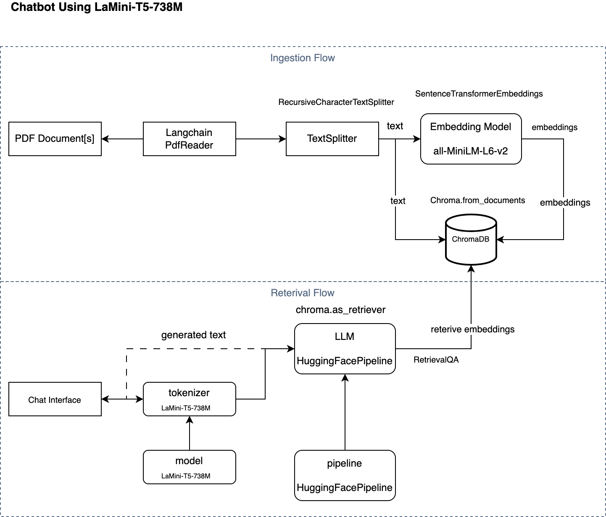

# AirPlane ChatBot LLM

This talks about creating a ChatBot for answering question regarding AirPlanes, Pilot Training, and Private Pilot License.

We are using [LaMini-T5-738M](https://huggingface.co/MBZUAI/LaMini-T5-738M) (a Diverse Herd of Distilled Models from Large-Scale Instructions) a large language model is a fine-tuned version of t5-large on LaMini-instruction dataset that contains [2.58M](https://huggingface.co/datasets/MBZUAI/LaMini-instruction) samples for instruction fine-tuning.

To answer questions on AirPlanes, Private Pilot License, we have to train the model with text pretaining to Airplane etc.

So for that we will using two pdf books: <\br>
* [Pilot’s Handbook of Aeronautical Knowledge](https://www.faa.gov/regulations_policies/handbooks_manuals/aviation/faa-h-8083-25c.pdf)
* [Airplane Flying Handbook](https://www.faa.gov/sites/faa.gov/files/regulations_policies/handbooks_manuals/aviation/airplane_handbook/00_afh_full.pdf)



login as root
```
conda create -n deeplearning101 python=3.10

```

activate deeplearning101 in root user

```
conda install pytorch torchvision torchaudio cudatoolkit -c pytorch
```

### Download AirPlane Handbook from FAA Website
```
    mkdir -p docs
   curl -O https://www.faa.gov/sites/faa.gov/files/regulations_policies/handbooks_manuals/aviation/airplane_handbook/00_afh_full.pdf
   curl -O https://www.faa.gov/regulations_policies/handbooks_manuals/aviation/faa-h-8083-25c.pdf
```

### Clone LaMini-T5-738M from HuggingFace

Install git lfs before cloning, for ubuntu

```
sudo apt-get install git-lfs
```
to clone large files use git-lfs
```
git-lfs install
git clone https://huggingface.co/MBZUAI/LaMini-T5-738M
```

### Running Gradio on FastAPI using Gunicorn

```
gunicorn run:app --workers 4 --worker-class uvicorn.workers.UvicornWorker --bind 0.0.0.0:5000 --daemon
```

